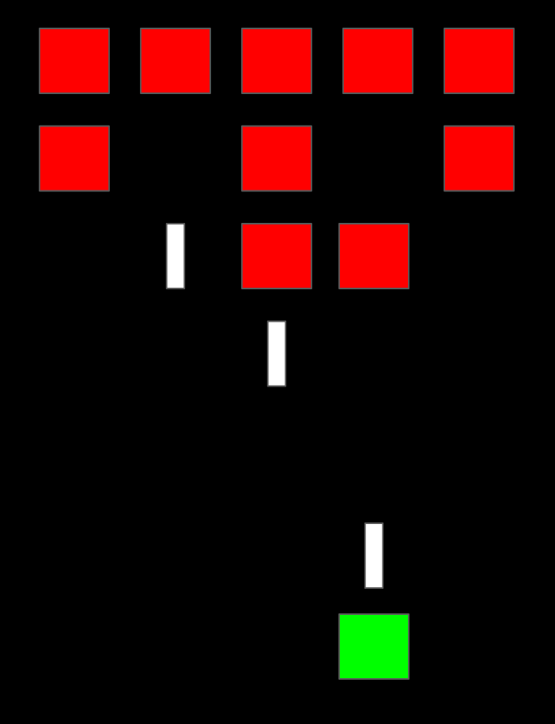

## Lab 4 Design Specification
Lyle Cheatham, 20603794 | Robin Pearce, 20690721

### Game

The game that is being created is a variant of the popular arcade game "Space
Invaders." In this game, the player controls a ship at the bottom of the
screen, and can move it left and right, and also shoot a laser cannon. At the
top of the screen, there is a grid of enemy ships moving left and right, slowly
advancing towards the player. These ships also randomly shoot at the player.

The goal of the game is to shoot all of the enemy ships without getting hit.
The game ends when all enemy ships are eliminated, or when the player gets hit
by an enemy laser shot.

Throughout the game, the enemy ships will increase in speed to make the game
harder.

### Peripherals

+---------------+---------------------------------------------------------------+
| Peripheral    | Purpose                                                       |
+===============+===============================================================+
| Joystick      | Control the left/right position of the                        |
|               | player ship.                                                  |
|               |                                                               |
+---------------+---------------------------------------------------------------+
| Button        | Used to start the game and to shoot a laser                   |
|               | from the player ship.                                         |
|               |                                                               |
+---------------+---------------------------------------------------------------+
| LCD           | Display for the game.                                         |
|               |                                                               |
+---------------+---------------------------------------------------------------+
| LEDs          | Used to display the score in binary.                          |
|               |                                                               |
+---------------+---------------------------------------------------------------+

#### Joystick Task

This task reads the joystick value, and set an integer to either -1 for
movement left, +1 for movement right, and zero if there is no movement. This
value can be accessed by a 'getter' function, and is cleared at the same time.

#### Button Task

This task polls the button, and sets a flag if a laser shot needs to be made.
This flag can be read through a function from another task.  This function also
clears the flag, such that multiple shots do not result from one button press.

The button task also handles the advancement of the game state from
`idle`/`lost` to playing.

#### Score Task

The score task reads the score from a function, and then displays it on the
LEDs, in binary.

Additionally, it will check the game state, and if there is transition from
playing, to lost, it will flash on and off 3 times quickly. After this, it
displays the score from the previous game until the game state transitions back
to the `playing` state.

#### Game Loop Task

This task handles the movement of the ships (player and enemy), the random
generation of laser shots from the enemy ships, the generation of laser shots
from the player ship (utilizing the flag checking function mentioned in the
Button Task specification), and the advancement of all laser shots.

This task also handles laser/ship collisions, incrementing the score if an
enemy ship is killed, and transitioning to the `lost` game state if the player
ship is hit.

Additionally, once the new positions of the ships and laser shots, it will
redraw the screen accordingly.

The game loop task is started by the button task when the game state
transitions to `playing`.

### Sample Graphics

{width=50%}
